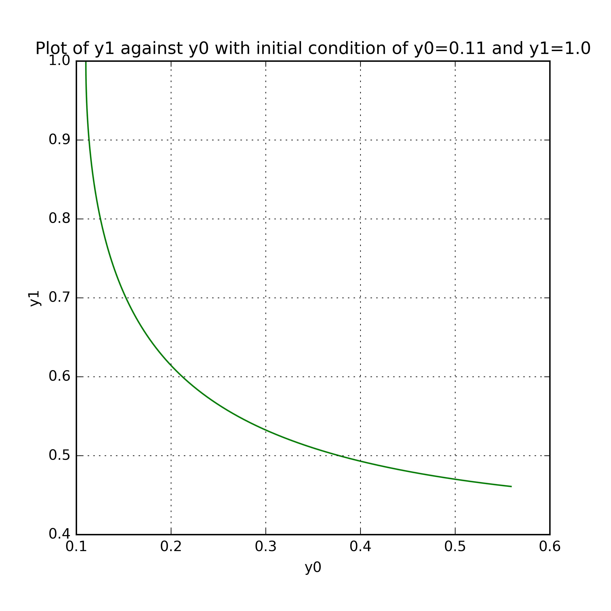

UECM3033 Assignment #3 Report
========================================================

- Prepared by:  **Penny Chong**
- Tutorial Group: T2

--------------------------------------------------------

## Task 1 --  Gauss-Legendre formula

The reports, codes and supporting documents are to be uploaded to Github at: 

[https://github.com/PennyChong/UECM3033_assign3](https://github.com/PennyChong/UECM3033_assign3)

Explain how you implement your `task1.py` here.

Generally, an integral defined over the interval of [a, b] must be changed to an integral defined over the interval [-1, 1] before using the Gauss-Legendre rule. It is because the weights and nodes used in  Gauss-Legendre quadrature, are computed based on the interval [-1, 1].

After performing a change of variable,the integral $$\int_a^{b} f(x)dx$$
becomes 

$$\frac{b-a}{2}\int_{-1}^{1} f(\frac{b-a}{2}x + \frac{a+b}{2} )dx $$

In our case, the integral $$\int_0^{1} f(x)dx $$
becomes$$\frac{1}{2}\int_{-1}^{1} f(\frac{1}{2}x + \frac{1}{2} )dx $$

Then, we use the Gauss-Lengendre formula 

 $$\int_0^{1} f(x)dx= \frac{1}{2}\sum_{i=1}^{n}w_i f(\frac{1}{2}x_i + \frac{1}{2} )$$
 to approximate the exact solution of the integral.
 
Explain how you get the weights and nodes used in the Gauss-Legendre quadrature.
 I have used the ***numpy.polynomial.legendre.leggauss(n)*** function to obtain the weights and nodes used in the Gauss-Legendre quadrature.

For **n=20**, Gauss-Legendre quadrature gives an approximation of **0.400338097411**

---------------------------------------------------------

## Task 2 -- Predator-prey model

Explain how you implement your `task2.py` here, especially how to use `odeint`.

To solve
$$ y'_0 = a(y_0 - y_0 y_1)$$ $$ y'_1 = b(-y_1 + y_0 y_1)$$
use the function ***odeint(odeFunc, init_cond, t, args=(a, b))***  
where

 - **odeFunc** is a function defining the set of differential equations
 - **init_cond** is the initial condition for y
 - **t** consists of 101 points from t=0 to t=5 years
 - **args=(a, b)** is the extra arguments that will be passed to the **odeFunc** function
 
With the initial condition, ***init_cond=[0.1,1.0]***  for part 1 and  the intital condition, ***init_cond=[0.11,1.0]*** for part 2 , we solved the differential equations. The graphs are shown below.

Put your graphs here and explain.

 
The graph above shows the preys, $y_0 $ increases with time while the predators, $ y_1 $ decreases with time.

 
The graph above shows that an inverse relationship exist between the preys, $y_0 $  and the predators,  $ y_1 $. 
As the number of preys increases, the number of predators decreases.

Now changing the initial condition of $y_0(0) $ from 0.1 to 0.11, we have the following plots.

 

 

Is the system of ODE sensitive to initial condition? Explain.
As observed above, the graphs do not change much when we imposed a different initial condition. Since the changes in the graphs are not significant, we claim that the system of ODE is insensitive to initial condition. In other words, the system of ODE is not sensitive to the changes in the initial condition.

**Note:**  Since github does not render equation well, you may view report.md with
[https://stackedit.io/editor](https://stackedit.io/editor)

-----------------------------------

last modified: 18/04/2016

